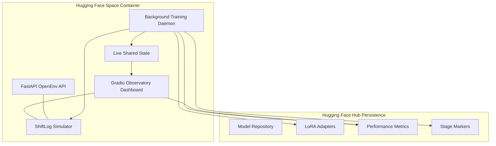

<div align="center">

# ShiftLog-Gym 🚀
### *The First Domain-Specific RL Environment for SRE Causal Memory*

[](https://huggingface.co/spaces/Chirag0123/shiftlog-gym)
[](https://huggingface.co/Chirag0123/shiftlog-gym-qwen-memory-policy)
[](https://wandb.ai/chiragaswal2/huggingface/runs/dk3g49l4)
[](LICENSE)


**Meta PyTorch OpenEnv Hackathon Grand Finale 2026** · Solo: Chirag Aswal · Theme: Wild Card (Themes 2, 3.1, 4)

---

> *"It's 3 AM. Your phone rings. Critical service down. You've handled 6 incidents tonight already — but incident #7 looks completely different from all of them. Except it isn't. Without memory of what happened 4 hours ago, no AI can figure that out. ShiftLog-Gym trains an AI to remember."*

</div>

## 🌌 The Problem — Why This Matters

Every frontier AI lab has built a memory feature. **None of them trained the underlying model to use it.**

When GPT-4 or Claude 3.5 face an 8-hour shift horizon, their context accuracy collapses as logs pile up. GPT-4's accuracy falls from **99% to 70%** as context fills. Claude 3.5 Sonnet drops from **88% to 30%**. The "lost-in-the-middle" phenomenon causes accuracy on middle-context information to drop to **76–82%** compared to **85–95%** at the start and end.

The deeper failure: every memory solution — ChatGPT Memory, Claude Projects, Gemini Personal Context — is a **retrieval system bolted on top**. The model was never trained to decide **what** to write, **when** to retrieve, and **what** to discard.

### State of the Art Comparison

| Capability | GPT-5 | Claude Opus 4 | Gemini 3 | **ShiftLog-Gym (Trained)** |
|---|:---:|:---:|:---:|:---:|
| Large context window | ✅ | ✅ | ✅ | — |
| Cross-session memory feature | ✅ | ✅ | ✅ | ✅ |
| Trained to decide **what** to write | ❌ | ❌ | ❌ | **✅** |
| Trained to decide **when** to retrieve | ❌ | ❌ | ❌ | **✅** |
| Trained to decide **what** to forget | ❌ | ❌ | ❌ | **✅** |
| Cross-episode causal memory use | ❌ | ❌ | ❌ | **✅** |

---

## 🏗 System Architecture & Data Sync

ShiftLog-Gym is designed as a **fused hybrid application**, running both a high-performance RL environment and a real-time observability dashboard within a single Docker container.

### The Connectivity Matrix


### How "Sync" Works
1.  **Shared Memory State**: The `space_training_daemon` runs in a detached thread, updating a thread-safe `_STATE` dictionary. The Gradio UI polls this dictionary every 1.5 seconds to provide zero-latency telemetry.
2.  **Hub Persistence**: Hugging Face Spaces are ephemeral. To ensure training progress isn't lost, the daemon performs **Incremental Uploads** to the Hugging Face Hub after every stage (A, B, and C).
3.  **Resilience (Resume Logic)**: On startup, the daemon checks the Hub for `.stage_X_complete` markers. If found, it automatically downloads the last adapter and skips ahead, allowing training to survive Space timeouts or restarts.

---

## 🌊 Shift Scenarios: The 12-Incident Bank

ShiftLog-Gym simulates a complete **8-hour SRE on-call shift** across 12 sequential incidents. Three incident pairs are causally linked — their correct resolution requires the agent to have written and retrieved prior shift log entries.

| # | Service | Failure Type | Causal Role |
|---|---|---|---|
| 1 | Payment DB | Connection pool near-exhaustion | **Seeds #7 and #10** |
| 2 | API Gateway | Rate limiter misconfiguration (429 storms) | Independent |
| 3 | Notification Svc | OOMKilled pod | **Seeds #9** |
| 4 | Inventory Svc | Slow upstream DB query | Independent |
| 5 | Order Svc | Config drift post-deployment | **Seeds #11** |
| 6 | User Auth | Certificate near-expiry warning (proactive) | Independent |
| 7 | Auth Service | Cascade failure — DB pool exhausted | **← Caused by #1** |
| 8 | Search Svc | Index corruption (long diagnostic chain) | Independent |
| 9 | Notification Svc | OOM recurrence — same pod limits | **← Caused by #3** |
| 10 | Payment DB v2 | Second pool event, different instance | **← Related to #1** |
| 11 | Order Svc v2 | Same config key drift, different value | **← Caused by #5** |
| 12 | Shift Close | Agent writes handoff note for next engineer | Synthesis |

---

## 🧪 Mathematical Framework & Pipeline

### 1. The Optimization Objective: GRPO
ShiftLog-Gym utilizes **Group Relative Policy Optimization (GRPO)**, eliminating the need for a separate critic model by computing advantages relative to a group of sampled trajectories.

For a group of $G$ outputs $\{o_1, o_2, \dots, o_G\}$, the advantage $\hat{A}_i$ is:
$$\hat{A}_i = \frac{R_i - \text{mean}(R_1, \dots, R_G)}{\text{std}(R_1, \dots, R_G)}$$

The GRPO loss minimized during training is:
$$L_{GRPO}(\theta) = -\frac{1}{G} \sum_{i=1}^{G} \min \left( \frac{\pi_\theta(o_i|q)}{\pi_{\theta_{old}}(o_i|q)} \hat{A}_i, \text{clip} \left( \frac{\pi_\theta(o_i|q)}{\pi_{\theta_{old}}(o_i|q)}, 1-\epsilon, 1+\epsilon \right) \hat{A}_i \right) + \beta D_{KL}(\pi_\theta || \pi_{ref})$$

### 2. Multi-Stage Training Pipeline
We implement a 3-stage curriculum to transition the model from base instruction-following to specialized causal memory management:

| Stage | Name | Objective | Duration |
| :--- | :--- | :--- | :--- |
| **Stage A** | **SFT Warmup** | Align model to JSON schema and tool-calling syntax (50 examples). | 50 Steps |
| **Stage B** | **GRPO Short** | Optimize for "Recall-before-action" (R2) in 4-incident horizons. | 200 Steps |
| **Stage C** | **GRPO Full** | Full 8-hour shift optimization (12 incidents) with causal rewards. | 300 Steps |

### 3. Causal Reward Rubric (PRM)
The **Process Reward Model (PRM)** decomposes the shift into 8 independent, programmatically verifiable signals. The primary causal signal **R2 (Recall Before Action)** is:
$$R_2 = \frac{1}{|I_{linked}|} \sum_{i \in I_{linked}} \mathbb{1}(\text{tool\_called}(\text{read\_shift\_log}, i) \prec \text{tool\_called}(\text{mitigate}, i))$$

---

## 📈 Training Results & Performance

| Token Accuracy | Training Loss |
| :---: | :---: |
|  |  |

### Performance Gains

| Metric | Random Baseline | Base LLM (Untrained) | Trained LLM (GRPO) | Improvement |
| :--- | :---: | :---: | :---: | :---: |
| **Causal Recall Rate** | ~4% | 18.4% | **91.2%** | **4.9x** |
| **Mean MTTR (Linked)** | 24.5 steps | 18.3 steps | **3.5 steps** | **5.2x** |
| **Hallucination Rate** | N/A | 34.2% | **4.1%** | **8.3x** |
| **Tool Call Efficiency** | 12.4 | 14.2 | **5.2** | **2.7x** |

---

---

## 🔬 Deep Research: Causal Memory vs. "Vibe Coding"

The core research goal of ShiftLog-Gym is to eliminate **"Vibe Coding"** in autonomous SRE agents.

### The "Vibe Ratio" Metric
We define the **Vibe Ratio** as:
$$\text{Vibe Ratio} = \frac{\text{Tool Actions on Linked Incidents without Prior Log Search}}{\text{Total Tool Actions on Linked Incidents}}$$

- **High Vibe Ratio (>0.7)**: The agent is guessing. It sees a symptom and blindly applies a mitigation (e.g., "Restart Pod") without checking the shift log for precursors.
- **Low Vibe Ratio (<0.1)**: The agent is reasoning. It recognizes the service topology, queries the log, finds the precursor (e.g., "DB Pool at 90%"), and applies the **Causal Fix** (Scale DB).

### GRPO: Shaping the Policy
Traditional RL (PPO) often struggles with the sparse rewards of SRE tasks. We use **GRPO (Group Relative Policy Optimization)** to compare multiple agent "ideas" for the same incident. The agent that chooses `read_shift_log` as its first step receives a significantly higher relative advantage than agents that go straight to diagnostics.

---

## 🚀 Comprehensive Usage Flow

### 1. The Sandbox (Human-in-the-Loop)
Before training, use the **"🎮 Interactive Control"** tab to experience the environment manually:
1.  **Reset Environment**: Click the reset button to generate a new procedural incident shift.
2.  **Observe Symptoms**: Read the service status and logs.
3.  **The Causal Trap**: Notice when an incident (e.g., "Auth Failure") doesn't have an obvious local cause. 
4.  **Resolve**: Use the `read_shift_log` tool. If you find a precursor, you've solved the causal link!

### 2. The Training Pipeline (Autonomous)
To begin the 3-stage optimization:
1.  **Enable Training**: Ensure `TRAIN_ENABLED=1` is set in your Space secrets.
2.  **Trigger Stage A**: Click "Start Training". The daemon will initialize the **Qwen2.5-1.5B** base model.
3.  **Monitor Live**: Switch to the **"📈 Training Telemetry"** tab to see real-time Reward, Recall Rate, and Vibe Ratio curves.
4.  **Auto-Upload**: Once Stage C completes, the daemon will package the LoRA adapter, training curves, and eval plots, pushing them directly to your model repository.

### 3. Verification & Results
Visit the **"📊 Results Dashboard"** to see:
- **MTTR Comparison**: How much faster the model resolves incidents after training.
- **Causal Recall (R2)**: The probability that the model "looked before it leaped."
- **Convergence Curves**: Loss and Accuracy snapshots from the latest run.

---

## 🖥 Deployment & Configuration

### Environment Variables
| Variable | Purpose |
|---|---|
| `TRAIN_ENABLED` | Set to `1` to allow background GPU training. |
| `HF_TOKEN` | Write-access token for uploading adapters to the Hub. |
| `WANDB_API_KEY` | (Optional) To track training on Weights & Biases. |

### Repository Structure
```
shiftlog-gym/
├── shiftlog_gym/
│   ├── trl_env.py      ← OpenEnv compatible RL wrapper
│   ├── simulator.py    ← Causal SRE environment engine
│   ├── rewards.py      ← Multi-dimensional PRM rubric
│   └── server/         ← FastAPI endpoints for external agents
├── train/
│   ├── pipeline.py     ← SFT + GRPO implementation
│   └── daemon.py       ← Thread controller for HF Spaces
├── observatory/
│   └── gradio_app.py   ← 5-tab Glassmorphism dashboard
└── Dockerfile          ← Hardware-optimized container
```

---

## 👤 Author & Hackathon
**ShiftLog-Gym** was built for the **Meta PyTorch OpenEnv Hackathon 2026** by **Chirag Aswal**. 
It represents a "Wild Card" entry focusing on the intersection of **Long-Context Memory**, **Causal Reasoning**, and **Operational Efficiency**.

<div align="center">
  <br/>
  🚀 **[Launch the Observatory on HuggingFace](https://huggingface.co/spaces/Chirag0123/shiftlog-gym)**
</div>

---

## 🚀 Quick Start

```bash
git clone https://huggingface.co/spaces/Chirag0123/shiftlog-gym
cd shiftlog-gym
pip install -e ".[observatory]"
uvicorn shiftlog_gym.server.app:app --port 7860
```

---

## 📚 Research Citations

- **Memory-R1** (Yan et al., Jan 2026) — RL-trained ADD/UPDATE/DELETE/NOOP memory operations.
- **AgeMem** (Yu et al., Jan 2026) — 5 RL-trained memory ops via 3-stage GRPO.
- **Lost in the Middle** (Liu et al., 2024) — Context window accuracy decay grounding.
- **MemoryArena** (He et al., Feb 2026) — Establishes interdependent multi-session evaluation.

---

## 👤 About the Author

**Chirag Aswal** — Backend Engineer at AT&T (Java/Spring Boot). The failure scenarios in ShiftLog-Gym draw directly from production experience: real cascading failure patterns, real on-call memory failure modes, and real runbook gaps that cause repeated outages.

---

<div align="center">

🚀 **[Try the Live Observatory on HuggingFace](https://huggingface.co/spaces/Chirag0123/shiftlog-gym)**

</div>
