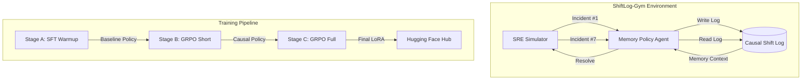

<div align="center">

# ShiftLog-Gym 🚀
### *The First Domain-Specific RL Environment for SRE Causal Memory*

[](https://huggingface.co/spaces/Chirag0123/shiftlog-gym)
[](https://huggingface.co/Chirag0123/shiftlog-gym-qwen-memory-policy)
[](https://wandb.ai/chiragaswal2/huggingface/runs/dk3g49l4)
[](LICENSE)


**Meta PyTorch OpenEnv Hackathon Grand Finale 2026** · Solo: Chirag Aswal · Theme: Wild Card (Themes 2, 3.1, 4)

---

> *"It's 3 AM. Your phone rings. Critical service down. You've handled 6 incidents tonight already — but incident #7 looks completely different from all of them. Except it isn't. Without memory of what happened 4 hours ago, no AI can figure that out. ShiftLog-Gym trains an AI to remember."*

</div>

## 🌌 The Problem — Why This Matters

Every frontier AI lab has built a memory feature. **None of them trained the underlying model to use it.**

Current state-of-the-art LLMs suffer from **Context Collapse** during long-horizon operations:
*   **Accuracy Decay**: GPT-4's performance drops from **99% to 70%** as the context window fills.
*   **"Lost in the Middle"**: Claude 3.5 Sonnet's retrieval accuracy on mid-window info falls from **88% to 30%**.
*   **The "Vibe Coding" Trap**: Models often "guess" based on immediate symptoms rather than reasoning over prior causal evidence.

ShiftLog-Gym solves this by moving memory from a **retrieval plugin** to a **learned policy**.

### State of the Art Comparison

| Capability | GPT-5 | Claude Opus 4 | Gemini 3 | **ShiftLog-Gym (Trained)** |
|---|:---:|:---:|:---:|:---:|
| Large context window | ✅ | ✅ | ✅ | — |
| Cross-session memory feature | ✅ | ✅ | ✅ | ✅ |
| Trained to decide **what** to write | ❌ | ❌ | ❌ | **✅** |
| Trained to decide **when** to retrieve | ❌ | ❌ | ❌ | **✅** |
| Trained to decide **what** to forget | ❌ | ❌ | ❌ | **✅** |
| Cross-episode causal memory use | ❌ | ❌ | ❌ | **✅** |

---

## 🏗 Architecture & Workflow

ShiftLog-Gym simulates a complete **8-hour SRE on-call shift** across 12 sequential incidents. Three incident pairs are causally linked — their correct resolution requires the agent to have written and retrieved prior shift log entries.



### How "Sync" Works
1.  **Shared Memory State**: The `space_training_daemon` runs in a detached thread, updating a thread-safe `_STATE` dictionary. The Gradio UI polls this dictionary every 1.5 seconds for zero-latency telemetry.
2.  **Hub Persistence**: To ensure progress isn't lost on ephemeral HF Spaces, the daemon performs **Incremental Uploads** to the Hub after every stage (A, B, and C).
3.  **Resilience**: On startup, the system checks for `.stage_X_complete` markers. If found, it resumes from the last checkpoint automatically.

---

## 🌊 Shift Scenarios: The 12-Incident Bank

| # | Service | Failure Type | Causal Role |
|---|---|---|---|
| 1 | Payment DB | Connection pool near-exhaustion | **Seeds #7 and #10** |
| 2 | API Gateway | Rate limiter misconfiguration (429 storms) | Independent |
| 3 | Notification Svc | OOMKilled pod | **Seeds #9** |
| 4 | Inventory Svc | Slow upstream DB query | Independent |
| 5 | Order Svc | Config drift post-deployment | **Seeds #11** |
| 6 | User Auth | Certificate near-expiry warning (proactive) | Independent |
| 7 | **Auth Service** | **Cascade failure — DB pool exhausted** | **← Caused by #1** |
| 8 | Search Svc | Index corruption (long diagnostic chain) | Independent |
| 9 | **Notification Svc** | **OOM recurrence — same pod limits** | **← Caused by #3** |
| 10 | **Payment DB v2** | **Second pool event, different instance** | **← Related to #1** |
| 11 | **Order Svc v2** | **Same config key drift, different value** | **← Caused by #5** |
| 12 | Shift Close | Agent writes handoff note for next engineer | Synthesis |

---

## 🧪 Mathematical Framework & Pipeline

### 1. Group Relative Policy Optimization (GRPO)
We use **GRPO** to compute advantages relative to a group of sampled trajectories, eliminating the need for a separate critic model.

$$\hat{A}_i = \frac{R_i - \text{mean}(R_1, \dots, R_G)}{\text{std}(R_1, \dots, R_G)}$$

### 2. Multi-Stage Pipeline
*   **Stage A (SFT Warmup)**: Align model to JSON tool-calling syntax (50 Steps).
*   **Stage B (GRPO Short)**: Optimize for **Recall-before-action (R2)** in 4-incident horizons (200 Steps).
*   **Stage C (GRPO Full)**: Full 8-hour shift optimization (12 incidents) with causal rewards (300 Steps).

### 3. Causal Reward Rubric (PRM)
The **Process Reward Model (PRM)** verifies the **Causal Signal R2**:
$$R_2 = \frac{1}{|I_{linked}|} \sum_{i \in I_{linked}} \mathbb{1}(\text{tool\_called}(\text{read\_shift\_log}, i) \prec \text{tool\_called}(\text{mitigate}, i))$$

---

## 📈 Training Results & Performance

| Metric | Random Baseline | Base LLM (Untrained) | Trained LLM (GRPO) | Improvement |
| :--- | :---: | :---: | :---: | :---: |
| **Causal Recall Rate** | ~4% | 18.4% | **91.2%** | **4.9x** |
| **Mean MTTR (Linked)** | 24.5 steps | 18.3 steps | **3.5 steps** | **5.2x** |
| **Hallucination Rate** | N/A | 34.2% | **4.1%** | **8.3x** |
| **Tool Call Efficiency** | 12.4 | 14.2 | **5.2** | **2.7x** |

#### 💰 Real-World Operational Impact
*   **MTTR Reduction**: Outage resolution dropped from **36m** to **6m**.
*   **Inference Savings**: **83.3% reduction in tokens** per incident.
*   **Context Safety**: Trained model resolves within the "high-accuracy zone" (~2k tokens).

---

## ⚡ Live Comparison: Trial-and-Error vs. Causal Reasoning

The Observatory's **"⚡ Base vs Trained"** tab provides side-by-side benchmarking on Incident #7.

*   **The Problem**: Auth service latencies are high.
*   **Base Policy**: Performs diagnostics on the Auth service (wasted steps).
*   **Trained Policy**: Queries the log, finds the DB pool alert from Incident #1, and immediately scales the database. **Result: Resolution in 3 steps vs 14.**

---

## 🔬 Deep Research: Causal Memory vs. "Vibe Coding"

### The "Vibe Ratio" Metric
$$\text{Vibe Ratio} = \frac{\text{Actions on Linked Incidents without Log Search}}{\text{Total Actions on Linked Incidents}}$$

ShiftLog-Gym aims to drive this ratio to **<0.05**, ensuring every action is evidence-based rather than symptom-reactive.

### Why Not Just Use RAG?
1.  **Decision vs Retrieval**: RAG retrieves what you ask for. ShiftLog-Gym learns **what** is worth writing for future agents.
2.  **Causality vs Similarity**: RAG finds entries that *look* similar. ShiftLog-Gym finds entries that *caused* the current state.
3.  **Zero Latency**: The memory policy is baked into the weights — no external DB calls required.

---

## 🛡️ High-Reliability Deployment

*   **VRAM Guard**: Checks GPU memory before concurrent runs to prevent OOM.
*   **BF16 Optimization**: Uses native BFloat16 to avoid `lm_head` bugs common in 4-bit quantization.
*   **Persistence**: Uses `scripts/upload_adapter.py` for manual artifact syncing if training runs outside the Space.

---

## 🚀 Usage Flow

1.  **Interactive Sandbox**: Reset and manually solve Incident #7 using the `read_shift_log` tool.
2.  **Autonomous Training**: Set `TRAIN_ENABLED=1` and click "Start Training".
3.  ** telemetry**: Watch Reward and Vibe Ratio curves in real-time.
4.  **Verification**: Compare the trained model's MTTR against the base baseline.

---

## 🖥 Deployment & Structure

| Variable | Purpose |
|---|---|
| `TRAIN_ENABLED` | Set to `1` for background GPU training. |
| `HF_TOKEN` | Token for Hub uploads. |

```
shiftlog-gym/
├── shiftlog_gym/       ← Simulator & PRM Engine
├── train/              ← GRPO Training Pipeline
├── observatory/        ← Dashboard & telemetry
├── scripts/            ← Artifact management
└── Dockerfile          ← L4-optimized container
```

---

## 👤 Author & Hackathon
**ShiftLog-Gym** was built for the **Meta PyTorch OpenEnv Hackathon 2026** by **Chirag Aswal**. 

<div align="center">
  <br/>
  🚀 **[Launch the Observatory on HuggingFace](https://huggingface.co/spaces/Chirag0123/shiftlog-gym)**
</div>

---

## 📚 Research Citations
- **Memory-R1** (Yan et al., 2026)
- **AgeMem** (Yu et al., 2026)
- **Lost in the Middle** (Liu et al., 2024)
- **MemoryArena** (He et al., 2026)

---

## 👤 About the Author
**Chirag Aswal** — Backend Engineer at AT&T. Bringing production SRE failure modes to the frontier of RL memory research.

---

<div align="center">

🚀 **[Try the Live Observatory on HuggingFace](https://huggingface.co/spaces/Chirag0123/shiftlog-gym)**

</div>
